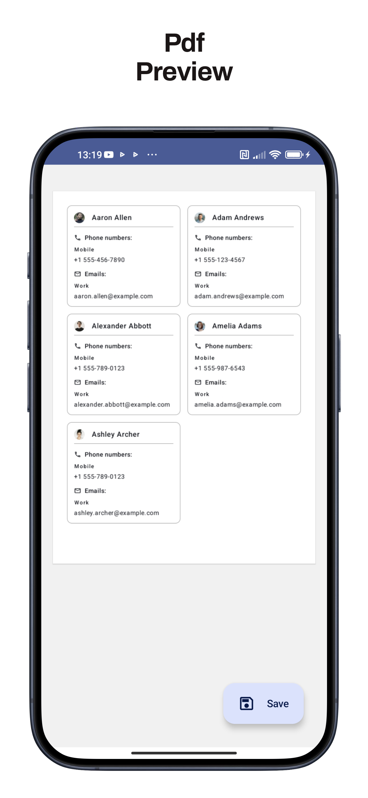

# ExportMyContacts

**Convert your phone book contacts into PDF format easily.**

ExportMyContacts is a simple app designed to export your phone book contacts into a PDF file. You can generate a PDF document containing all your contacts, making it easy to share or archive them.

 

## Screenshots

    
    

 

## Project architecture

The architecture of the project is based on domain driven design, the domain layer is the most inner circle following clean architecture guide line, although a simpler architecture closer to Android guidelines could have been chosen, this architecture leaves open the possibilities for expansion and development of the same, making the boilerplate code an acceptable price to pay.

 

## Tech Stack

**Architecture:** Domain Driven Design, MVI

**Dependency injection:** Dagger Hilt

**Database:** Realm

**Logging:** [Timber](https://github.com/JakeWharton/timber)

**UI:** Jetpack Compose, Material 3

 

## Was it useful?

 

